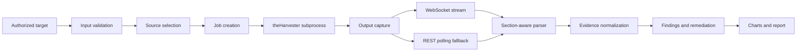

# Design and Implementation of an Authorized Passive OSINT Web Platform for Security Assessment

## A Final-Year Project Report

**Student:** [Student Name]  
**Student ID:** [Student ID]  
**Programme:** [Programme Name]  
**Department:** [Department Name]  
**Institution:** [College/University Name]  
**Supervisor:** [Supervisor Name]  
**Submission date:** [Month Year]

---

## Declaration

I declare that this project report is my original academic work, except where sources, software dependencies, and external references have been acknowledged. The implementation described in this report is intended for lawful, authorized, and defensive security assessment. It does not provide unrestricted exploitation, credential attacks, persistence, or access to third-party camera feeds.

**Signature:** ____________________  
**Date:** ____________________

## Approval

This report is submitted with the approval of the project supervisor and the relevant academic department.

**Supervisor signature:** ____________________  
**Date:** ____________________

## Acknowledgements

I would like to thank [institution, supervisor, colleagues, and family] for their guidance and support during the design, implementation, testing, and documentation of this project.

## Abstract

Organizations increasingly depend on internet-facing services, cloud infrastructure, and third-party platforms. As a result, security teams require practical methods for identifying publicly observable information about assets they own. This project presents the design and implementation of an authorized passive Open-Source Intelligence (OSINT) web platform that collects, normalizes, visualizes, and reports publicly available domain and asset information. The platform integrates theHarvester as the primary collection engine and provides a FastAPI backend, a React/Vite frontend, WebSocket streaming with REST polling fallback, Shodan-based passive asset metadata review, structured evidence and findings endpoints, and a synthetic localhost testing laboratory.

The system accepts a validated domain or IP-related assessment target, a selected set of passive sources, a result limit, and an optional DNS-brute-force setting. It launches the collection process without shell-string interpolation, captures output, separates provider diagnostics from discovered entities, and presents emails, hosts, IP addresses, URLs, services, findings, and remediation guidance. The implementation also includes explicit authorization confirmation for Shodan asset review and excludes active exploitation, authentication attempts, arbitrary service access, and camera-feed discovery or viewing. A deterministic Python laboratory supplies synthetic values such as `security@lab.test`, `portal.lab.test`, documentation IP addresses, and harmless service metadata for repeatable UI and parser testing.

Testing included backend unit and integration tests, parser regression tests, frontend production builds, local replay execution, API health checks, and verification that false positives such as theHarvester’s author email, configuration filenames, and diagnostic IP addresses were not presented as target findings. The resulting platform demonstrates how OSINT collection can be transformed into reviewable evidence and remediation-oriented findings while maintaining clear legal, ethical, and technical boundaries.

**Keywords:** passive OSINT, cybersecurity, theHarvester, Shodan, FastAPI, React, evidence collection, security assessment, web application

---

## Table of Contents

1. Introduction  
2. Background and Literature Review  
3. Requirements Analysis  
4. Methodology  
5. System Design  
6. Implementation  
7. Testing and Evaluation  
8. Ethical, Legal, and Privacy Considerations  
9. Limitations and Future Work  
10. Conclusion  
References  
Appendices

---

# Chapter 1: Introduction

## 1.1 Background

Modern organizations expose a large amount of information through domain names, certificate records, public web pages, indexed service banners, software metadata, and third-party information platforms. Individual observations may appear harmless, but when correlated they can reveal an organization’s public attack surface, technology choices, hostnames, email patterns, and exposed services. A structured OSINT process can therefore support defensive asset inventory and security improvement without requiring intrusive testing.

Security testing should be planned, scoped, executed, analyzed, and reported as a controlled process rather than treated as an isolated technical activity. The National Institute of Standards and Technology (NIST) describes security testing as an activity that should assist organizations in conducting technical assessments, analyzing findings, and developing mitigation strategies (Scarfone et al., 2008). Similarly, the Open Web Application Security Project’s Web Security Testing Guide places information gathering at the beginning of a broader testing process and includes activities such as search-engine discovery, server fingerprinting, review of web content, and application mapping (OWASP Foundation, n.d.).

This project applies those principles to a web-based passive OSINT workflow. The platform is not intended to prove that a target is vulnerable. Instead, it provides a controlled mechanism for collecting publicly observable evidence about an authorized target and converting that evidence into understandable findings.

## 1.2 Problem Statement

Many OSINT tools are powerful but difficult for students, small organizations, and non-specialist operators to use consistently. Command-line output can be difficult to interpret, provider errors can be confused with genuine findings, and broad regular-expression parsing can produce false positives. For example, a tool banner may contain the developer’s email address, a configuration path may resemble a hostname, and a diagnostic line may contain an IP address that was queried rather than discovered. Without structured parsing and clear evidence boundaries, users may report inaccurate results.

A second problem is operational complexity. The operator must configure a Python environment, run a backend process, run a frontend development server, configure optional API credentials, select appropriate passive sources, wait for long-running jobs, and interpret incomplete provider responses. A practical academic system should make those stages visible and provide diagnostics when a provider is unavailable, a WebSocket stream fails, or a scan returns no entities.

## 1.3 Aim

The aim of this project is to design and implement a web-based platform for authorized passive OSINT collection that captures public domain and asset information, separates genuine evidence from diagnostics, provides structured findings and remediation guidance, and presents the results through a usable dashboard.

## 1.4 Objectives

The project objectives are to:

1. design a web interface for configuring and launching authorized passive OSINT collections;
2. integrate theHarvester as a controlled local collection engine;
3. provide Shodan-based passive asset metadata review for approved domains and IP addresses;
4. capture live process output through WebSockets with REST polling fallback;
5. extract and display emails, hosts, IP addresses, URLs, people, and services from genuine result content;
6. prevent common false positives caused by banners, configuration paths, target metadata, and provider status lines;
7. provide structured run, evidence, findings, summary, and report endpoints;
8. create a Python-only synthetic localhost lab for repeatable testing; and
9. document ethical, legal, privacy, and operational safeguards.

## 1.5 Research Questions

The project addresses the following questions:

**RQ1.** How can a web platform collect passive OSINT while preserving strict target validation and authorization boundaries?

**RQ2.** How can raw theHarvester output be normalized into accurate, reviewable entities and evidence?

**RQ3.** How can long-running command execution and live output be presented reliably when WebSocket support is unavailable?

**RQ4.** How can Shodan metadata be integrated as a passive asset-review capability without enabling unauthorized service access or surveillance?

**RQ5.** How effectively can a deterministic local lab support repeatable testing of the platform’s parsers, charts, findings, and reports?

## 1.6 Scope

The platform’s scope is limited to passive or non-destructive assessment of domains and assets that the operator owns or is explicitly authorized to assess. Supported evidence includes domain-related emails, hosts, IP addresses, URLs, provider status, indexed service metadata, organization information, autonomous-system information, product labels, and timestamps when supplied by a provider.

The platform does not include exploit execution, password attacks, credential stuffing, authentication bypass, persistence, post-exploitation, arbitrary shell execution, active port scanning, service login, or access to live CCTV feeds. The local camera fixture used for testing returns synthetic metadata only and has no video stream.

## 1.7 Significance of the Project

The project is significant in four ways. First, it transforms complex command-line output into a web-based workflow that is easier to demonstrate and operate. Second, it addresses result quality by distinguishing evidence from diagnostics and by correcting false-positive entity extraction. Third, it demonstrates a practical architecture for asynchronous process execution, streaming output, fallback polling, and structured reporting. Fourth, it provides a safe educational laboratory so students can test UI behavior without targeting real systems.

---

# Chapter 2: Background and Literature Review

## 2.1 Open-Source Intelligence

OSINT refers to the collection and analysis of information that is publicly available or lawfully accessible for an authorized purpose. In cybersecurity, OSINT commonly supports asset discovery, technology identification, exposure review, threat intelligence, and situational awareness. The important distinction for this project is that public availability does not automatically create permission to access, reuse, or operationally test an asset. Authorization, purpose limitation, data minimization, and responsible handling remain necessary.

A passive workflow normally uses information already published or indexed by external sources. It avoids sending intrusive probes to the target and instead retrieves or processes available records. Passive collection reduces operational impact, but it does not remove privacy or legal obligations. Email addresses, hostnames, and service metadata can still be sensitive in context and should be retained only when needed for the approved assessment.

## 2.2 Information Gathering in Security Testing

The OWASP Web Security Testing Guide identifies information gathering as a major stage of web application security testing. Its information-gathering material covers search-engine discovery, web-server fingerprinting, web-server metafiles, application enumeration, page-content review, entry-point identification, framework fingerprinting, application fingerprinting, and application-architecture mapping (OWASP Foundation, n.d.). These activities establish why a structured reconnaissance stage is useful before deeper security review.

This project implements a narrower, passive subset of those ideas. It does not attempt to replace a complete web security testing methodology. Instead, it provides a reviewable evidence layer that can support later authorized assessment decisions. The platform’s findings are therefore phrased as observations and remediation suggestions rather than claims of exploitability.

## 2.3 Security Testing and Reporting

NIST SP 800-115 emphasizes planning, technical testing methods, analysis, and mitigation strategies (Scarfone et al., 2008). This project adopts the same broad pattern: define the target and scope, select sources, collect evidence, normalize the output, analyze findings, and produce a report. The system’s run metadata stores the target, command, selected sources, result limit, status, exit code, and timestamps. Its evidence and findings endpoints provide a traceable connection between raw output and displayed conclusions.

Reporting is important because a raw scanner log is not equivalent to an actionable security assessment. A useful report should identify what was observed, where it was observed, how confident the operator should be, and what should be done next. The project’s findings layer therefore distinguishes provider warnings, missing credentials, empty results, fallback behavior, and service metadata from actual discovered entities.

## 2.4 Shodan as a Passive Asset-Observation Source

Shodan’s developer documentation describes a host-information method that returns services found on a host IP, including general host information and service records (Shodan, n.d.). The documentation also describes host-search methods that return indexed banner information and related metadata. The project uses this capability as a passive asset-review source. It does not treat a Shodan record as proof that a service is currently reachable, safe to access, or vulnerable.

The platform’s Shodan workflow first validates the target and requires explicit authorization confirmation. For an authorized domain, it resolves the domain to IP addresses and requests indexed host metadata. The resulting UI emphasizes resolved addresses, hostnames, ports, products, organization, ASN, ISP, operating-system labels, and last-update data when available. It does not display camera feeds or attempt authentication.

## 2.5 Cybersecurity Risk Management

NIST presents the Cybersecurity Framework as a resource for organizations seeking to understand and improve cybersecurity-risk management (National Institute of Standards and Technology, 2024). This project aligns most closely with the framework’s risk-awareness and improvement orientation. It supports the identification and communication of publicly observable assets, but it does not claim to implement a complete organizational risk-management program.

The platform’s remediation guidance is intentionally conservative. For example, an indexed administration service may justify checking whether the service is intended to be public, whether access controls are configured, whether encryption is enabled, and whether the software is supported. It does not justify attempting to log in or exploit the service.

## 2.6 Technology Context

The implementation uses Python and FastAPI for the backend, React and Vite for the frontend, and theHarvester as the primary subprocess-based collection engine. FastAPI provides HTTP API routes and WebSocket support through the ASGI server. React provides stateful rendering for scan controls, live output, charts, evidence, findings, and reports. The architecture uses a job-oriented model so a scan can continue while the browser receives incremental status updates.

---

# Chapter 3: Requirements Analysis

## 3.1 Stakeholders

The primary stakeholder is a student or authorized security operator who needs to run a passive OSINT collection and explain the result. Secondary stakeholders include a project supervisor evaluating technical quality, an organization reviewing its public exposure, and a developer maintaining the platform.

## 3.2 Functional Requirements

| ID | Requirement |
|---|---|
| FR1 | The system shall accept a domain target and validate its syntax. |
| FR2 | The system shall allow the operator to select one or more whitelisted passive sources. |
| FR3 | The system shall accept a bounded result limit. |
| FR4 | The system shall support optional DNS brute-force configuration where permitted by the workflow. |
| FR5 | The backend shall launch theHarvester without constructing a shell command string for execution. |
| FR6 | The system shall capture process output and status. |
| FR7 | The system shall stream output through WebSockets when available. |
| FR8 | The system shall provide REST polling fallback when WebSockets are unavailable. |
| FR9 | The system shall display emails, hosts, IPs, URLs, people, and services from valid result content. |
| FR10 | The system shall exclude known diagnostic and banner values from structured findings. |
| FR11 | The system shall provide Shodan passive asset review only after explicit authorization confirmation. |
| FR12 | The system shall provide run metadata, evidence, findings, summaries, and report endpoints. |
| FR13 | The system shall provide safe diagnostics without exposing API keys. |
| FR14 | The system shall support a deterministic local test replay. |

## 3.3 Non-Functional Requirements

| Category | Requirement |
|---|---|
| Security | Inputs must be validated, sources whitelisted, commands executed without shell interpolation, and secrets excluded from responses, reports, and logs. |
| Privacy | The system must minimize collected information and restrict use to authorized targets. |
| Reliability | Long-running scans must not become false errors because a two-minute polling window expired. |
| Usability | The interface must provide clear setup, status, evidence, findings, and remediation information. |
| Maintainability | Backend results should use structured schemas and focused endpoints. |
| Portability | The project should run in a Windows Python virtual environment and Windows terminal workflow. |
| Testability | A deterministic local lab should produce repeatable expected values. |
| Performance | The interface should remain responsive while a background process runs. |

## 3.4 Use Cases

### Use Case 1: Run a Domain OSINT Collection

The operator starts the backend and frontend, enters an authorized domain, selects passive sources, chooses a result limit, and optionally enables DNS brute force. The system validates the request, creates a job, launches theHarvester, captures output, and displays the completed evidence.

### Use Case 2: Review an Authorized Shodan Asset

The operator opens the Shodan Assets module, enters an owned or approved domain/IP, confirms authorization, and starts the review. The backend validates the input, resolves an authorized domain if required, retrieves indexed metadata, and returns a structured result containing assets and services.

### Use Case 3: Test the Platform in the Local Lab

The operator configures `THEHARVESTER_COMMAND` to point to `mock_theharvester.py`, enters `lab.test`, and runs a scan. The deterministic replay emits known synthetic entities, allowing the operator to verify the UI, charts, findings, and reports without external network activity.

### Use Case 4: Diagnose a Failed Run

The operator checks `/api/health`, `/api/diagnostics`, the job result endpoint, backend logs, and the frontend status. The system distinguishes missing dependencies, missing provider credentials, WebSocket failure, polling behavior, provider errors, and genuine process failures.

---

# Chapter 4: Methodology

## 4.1 Development Approach

The project used an iterative prototyping approach. The initial implementation focused on launching theHarvester and displaying output. Subsequent iterations addressed missing runtime imports, configuration defaults, Windows startup, WebSocket dependencies, REST fallback, chart rendering, modular UI design, structured evidence, Shodan authorization, and false-positive parsing.

The iterative approach was appropriate because the project combined backend process management, browser state management, asynchronous communication, third-party provider behavior, and security-sensitive input validation. Each iteration was tested before the next feature was added.

## 4.2 Security-Oriented Design Principles

The design followed five principles.

**First, explicit authorization.** The Shodan module requires a confirmation that the target is owned by or approved for assessment. This confirmation is a user-interface gate and should be supplemented by organizational authorization in real use.

**Second, passive scope.** The system retrieves or processes public/indexed metadata and does not perform exploit attempts, authentication, or arbitrary service interaction.

**Third, command safety.** The backend constructs an argument list and launches the subprocess without shell parsing. The local-lab override is treated as one filesystem path and, for a Python file, is invoked through the active interpreter.

**Fourth, evidence traceability.** Structured entities should be traceable to captured output lines or provider records. Diagnostic messages are retained for troubleshooting but are not automatically classified as target evidence.

**Fifth, failure transparency.** Provider errors, missing credentials, empty results, WebSocket failures, and process failures should be visible and distinguishable. Hiding errors would make the interface appear more successful while reducing analytical reliability.

## 4.3 Data-Collection Workflow

The workflow is:



The browser submits a scan request to the FastAPI backend. The backend validates the domain, selected sources, and limit, creates a job record, and launches the collection process. Output lines are appended to the job. The frontend receives them through a WebSocket where possible. If the WebSocket is unavailable, the frontend polls the REST result endpoint until the job finishes or reaches the configured backend timeout.

## 4.4 Parser Methodology

The initial broad-regex parser produced false positives because it treated every email-like string, hostname-like string, or IP-like string as a finding. The revised parser uses result-section awareness and diagnostic exclusion. It recognizes labels such as “Emails found,” “Hosts found,” “IPs found,” “People found,” and “URLs found,” then evaluates values in the appropriate context. It excludes known banner addresses, configuration filenames, target metadata, provider search-status lines, and “No results found” lines.

The parser also supports legacy output where complete section headers may not be present, but it applies conservative filters to reduce the risk of reporting a diagnostic value as a target entity. This is a practical compromise because provider output formats can vary.

## 4.5 Evaluation Strategy

Evaluation combined automated and scenario-based testing. Automated tests checked API validation, authorization, command construction, parsing, endpoint behavior, and regression conditions. Scenario tests used the local replay to confirm that expected synthetic entities appeared in the interface. False-positive tests used the reported lines from a real scan log, including the theHarvester author email and Shodan status IP, to verify that these values were excluded.

---

# Chapter 5: System Design

## 5.1 Architecture

The system uses a three-layer architecture:

1. **Presentation layer:** React/Vite interface for configuration, streaming, charts, evidence, findings, history, reports, and documentation.
2. **Application layer:** FastAPI routes for validation, job creation, process execution, WebSocket streaming, REST polling, Shodan asset review, diagnostics, and reports.
3. **Collection and analysis layer:** theHarvester subprocess, Shodan client behavior, output parser, evidence normalizer, findings generator, and report formatter.

The browser does not execute theHarvester directly. It sends a request to the backend, which controls the process and retains the job state. This separation prevents client-side code from needing direct operating-system access.

## 5.2 Backend Components

| Component | Responsibility |
|---|---|
| Request validation | Validates domains, sources, limits, authorization state, and asset type. |
| Job manager | Creates and updates queued, running, finished, and error states. |
| Process runner | Executes theHarvester with an argument list and captures stdout/stderr. |
| Stream route | Sends command, status, output, and completion events over WebSockets. |
| Polling route | Returns current job state and captured output over HTTP. |
| Shodan review route | Validates an authorized domain/IP and returns passive indexed metadata. |
| Evidence normalizer | Extracts emails, hosts, IPs, URLs, people, and services. |
| Findings layer | Converts evidence and diagnostics into severity-tagged remediation items. |
| Report layer | Combines run metadata, evidence, findings, summary, and text output. |
| Diagnostics | Reports runtime and configuration state without returning secrets. |

## 5.3 Frontend Modules

The interface is organized into the following modules:

| Module | Purpose |
|---|---|
| Overview | Displays workspace status, recent jobs, and quick navigation. |
| Domain OSINT | Configures and launches theHarvester passive collection. |
| DNS & Certificates | Provides a place for passive DNS and certificate review workflows. |
| Shodan Assets | Performs authorized passive asset metadata review. |
| Camera Audit | Provides a metadata and hardening checklist for an owned camera inventory; no feed access. |
| Findings | Displays evidence-based findings and remediation. |
| Reports | Provides job history and report access. |
| Settings | Shows backend health, diagnostics, and configuration status. |
| `/doc` | Provides in-app instructions about how scanning works and how to run a scan. |

## 5.4 Data Model

A normalized run has the following conceptual structure:

```json
{
  "run_id": "job identifier",
  "module": "domain_osint or shodan_assets",
  "target": "authorized target",
  "authorized": true,
  "status": "completed",
  "sources": ["crtsh", "shodan"],
  "evidence": {
    "emails": [],
    "hosts": [],
    "ips": [],
    "urls": [],
    "people": [],
    "services": []
  },
  "findings": [],
  "errors": [],
  "summary": {
    "entity_count": 0,
    "output_lines": 0,
    "severity": {}
  }
}
```

The structure supports consistent presentation across modules. It also makes it possible to export a report without requiring the frontend to understand every provider-specific output format.

## 5.5 API Design

The main API routes include:

| Route | Description |
|---|---|
| `GET /api/health` | Returns service health. |
| `GET /api/diagnostics` | Returns credential-safe runtime and configuration state. |
| `GET /api/sources` | Returns the supported source list. |
| `POST /api/scan` | Creates a passive theHarvester job. |
| `GET /api/scan/{job_id}/result` | Returns job status and captured output. |
| `GET /api/scan/{job_id}/stream` | Streams job events through WebSockets. |
| `GET /api/scan/{job_id}/download` | Downloads a text report. |
| `POST /api/modules/shodan-assets/validate` | Validates an authorized Shodan target. |
| `POST /api/modules/shodan-assets/review` | Returns one structured passive asset-intelligence result. |
| `GET /api/runs` | Lists normalized assessment runs. |
| `GET /api/runs/{run_id}/summary` | Returns summary metrics. |
| `GET /api/runs/{run_id}/evidence` | Returns normalized evidence. |
| `GET /api/runs/{run_id}/findings` | Returns findings and remediation. |
| `GET /api/runs/{run_id}/report` | Returns combined run report data. |

## 5.6 Error States

The system distinguishes the following conditions:

- **Queued:** the job exists but has not started.
- **Running:** the subprocess is active and output may arrive.
- **Finished:** the process ended and the result is available.
- **Error:** the process failed, the configuration is invalid, or the backend timeout was reached.
- **Provider warning:** an external source returned no result, a missing credential warning, or an unexpected response. This is retained as diagnostic evidence and is not automatically treated as a discovered entity.
- **Fallback active:** the WebSocket is unavailable and the frontend is using REST polling.

---

# Chapter 6: Implementation

## 6.1 Environment Setup

The project supports Windows through a Python virtual environment. The normal operator workflow is:

```bash
cd /path/to/AI-hackingTool
py -3.12 -m venv .venv
source .venv/Scripts/activate
python -m pip install --upgrade pip
python -m pip install -e .
```

The frontend is installed separately:

```bash
cd frontend
npm install
```

The backend is started with Uvicorn:

```bash
python -m uvicorn backend.main:app --host 127.0.0.1 --port 8000 --reload
```

The frontend is started with Vite:

```bash
npm run dev
```

## 6.2 Credential Handling

The Shodan credential is configured locally through the `SHODAN_API_KEY` environment variable or through theHarvester’s local YAML fallback. The preferred Windows terminal configuration is:

```bash
export SHODAN_API_KEY='replacement-key-configured-locally'
```

The key is not returned by diagnostics, printed in reports, or included in bug reports. Any exposed key should be revoked and replaced.

## 6.3 theHarvester Integration

The backend constructs the process command as a list. In normal operation it resolves `theHarvester`, `theHarvester.exe`, or `theHarvester.py`, and otherwise falls back to the active Python interpreter’s module execution. The optional `THEHARVESTER_COMMAND` variable supports the synthetic local lab. A `.py` override is launched through the current Python interpreter, and no shell string is used.

The resulting command conceptually follows this structure:

```text
theHarvester -d authorized.example.com -b crtsh,shodan -l 100
```

The operator sees a human-readable version of the command in the interface, but execution uses the structured argument list. Source names are checked against a whitelist and limits are bounded.

## 6.4 Live Output and REST Fallback

The backend exposes a WebSocket stream for command, status, output, and completion events. The frontend tries this stream first. If the browser cannot establish a WebSocket or the server lacks a supported WebSocket runtime, the frontend switches to REST polling. The polling window is aligned with the backend’s long-running job timeout so a legitimate slow provider does not become a false error after two minutes.

This design improves reliability because the scan result does not depend entirely on a single transport. It also helps Windows operators diagnose missing WebSocket dependencies while still receiving the completed output.

## 6.5 Structured Evidence Extraction

The parser normalizes captured output into the following entity groups:

- emails;
- hosts and domains;
- IPv4 addresses;
- URLs;
- people; and
- services and ports.

The parser removes duplicates and excludes values from known diagnostics. For example, an address from the line `Searching Shodan for 192.0.2.11` is not classified as a discovered IP. Similarly, the theHarvester project author’s email address is not classified as an email belonging to the assessed target.

## 6.6 Findings and Remediation

The findings layer follows a conservative evidence-based approach. A missing API key produces a configuration finding. A provider parser error produces a provider-quality finding. A service banner may produce an observation that the organization should verify intended exposure, patch status, encryption, access control, and network placement. A finding does not claim exploitability unless a separate authorized assessment proves it.

## 6.7 Shodan Asset Intelligence

The Shodan module provides one focused result. The operator enters a domain or IP and confirms authorization. For a domain, the backend resolves the domain to addresses and requests indexed host metadata. For each result, the platform presents IP, hostnames, domains, ports, services, organization, ASN, ISP, operating system, and last-update information when present.

The interface includes a note that indexed data is an observation from a third-party index. It is not proof that the service is currently reachable or vulnerable. The feature does not search for or view CCTV feeds, attempt login, or interact with a service.

## 6.8 Local Synthetic Laboratory

A separate Python-only local laboratory environment was created for this project. Its replay script accepts `lab.test` and emits synthetic values:

```text
security@lab.test
research@lab.test
portal.lab.test
camera-gateway.lab.test
mail.lab.test
192.0.2.10
192.0.2.11
port 443 https nginx
port 8080 http lab-camera-gateway
```

The mock service listens on `127.0.0.1:18080` and returns synthetic JSON metadata. Its camera endpoint explicitly returns no stream. Reserved documentation names and IP addresses are used so the lab does not represent a real organization.

---

# Chapter 7: Testing and Evaluation

## 7.1 Test Strategy

Testing was divided into unit, integration, regression, build, and scenario tests. Unit and regression tests focused on validation, parser behavior, authorization, endpoint responses, and command construction. Integration testing exercised the backend job lifecycle and the frontend build. Scenario testing used the local replay to verify that known synthetic entities appeared in the correct UI panels.

## 7.2 Backend Tests

The project’s latest reported backend test run passed **120 tests**. Earlier checkpoints also passed focused regression suites for health checks, command construction, authorization, evidence, findings, reports, WebSocket fallback behavior, and parser corrections. The test suite included cases for:

- missing or invalid domains;
- unsupported sources;
- limits outside the allowed range;
- unauthorized Shodan requests;
- valid authorized domain and IP targets;
- safe command argument construction;
- missing local replay files;
- structured evidence extraction;
- report and summary endpoints; and
- false-positive exclusion.

## 7.3 Frontend Build Testing

The frontend production build completed successfully using Vite. This verified that the modular application shell, the `/doc` page, Shodan asset result presentation, evidence panels, findings module, charts, and responsive styles compiled without syntax errors.

## 7.4 Local Replay Evaluation

The local replay was executed directly and through the FastAPI backend. The backend was configured with:

```bash
export THEHARVESTER_COMMAND='/path/to/SandboxVernuableEnv/mock_theharvester.py'
```

A scan for `lab.test` completed with exit code `0`, and the backend returned captured output containing the expected synthetic entities. The local mock service also returned successful health and metadata responses at `127.0.0.1:18080`.

## 7.5 False-Positive Evaluation

The supplied `techspire.edu.np` report was used as a regression scenario. The raw log contained:

- `cmartorella@edge-security.com`, which came from the theHarvester banner;
- `api-keys.yaml` and `proxies.yaml`, which came from local configuration messages; and
- `190.92.174.33`, which appeared in a Shodan query/status line.

The revised parser excluded these values from target evidence. It also respected the explicit “No IPs found,” “No emails found,” and “No hosts found” messages. This changed the UI from reporting misleading entities to correctly showing zero discovered values.

## 7.6 Evaluation Against Requirements

| Requirement area | Outcome |
|---|---|
| Passive domain collection | Implemented through theHarvester workflow. |
| Shodan passive metadata | Implemented with authorization confirmation and structured result. |
| Long-running scans | Supported through extended polling and backend timeout alignment. |
| WebSocket failure handling | REST fallback implemented. |
| Entity accuracy | Section-aware and diagnostic-aware parser implemented. |
| Reporting | Run, evidence, findings, summary, and report routes implemented. |
| Windows operation | Virtual-environment workflow documented. |
| Safe testing | Separate Python replay and localhost mock service implemented. |
| UI usability | Modular workspace, evidence panels, charts, findings, and in-app documentation implemented. |

## 7.7 Discussion of Results

The evaluation indicates that the platform meets its core project objectives. It can launch and monitor a passive collection workflow, display captured output, normalize results, and provide a structured report. The false-positive regression is particularly important because it demonstrates that parser quality is not only a user-interface concern; inaccurate normalization can directly change the meaning of a security report.

The local lab improves repeatability. External providers can return different content, fail, require credentials, or change response formats. A deterministic replay isolates application behavior from those variables and allows a project examiner to verify the complete path from subprocess output to UI evidence.

The evaluation does not demonstrate that the platform discovers every possible public asset or that every provider is consistently available. It demonstrates correct behavior within the implemented scope and test fixtures.

---

# Chapter 8: Ethical, Legal, and Privacy Considerations

## 8.1 Authorization

The operator must obtain permission before assessing any domain, IP address, organization, or device inventory. A public record is not an invitation to conduct intrusive testing. Authorization should identify the owner, target range, time window, permitted methods, data-handling rules, and reporting contacts.

The application includes an authorization confirmation for Shodan review, but a checkbox is not a substitute for real permission. In an organizational deployment, the platform should store an approval reference or assessment ticket and restrict targets through an allowlist.

## 8.2 Privacy and Data Minimization

Emails, names, hostnames, and service metadata may constitute personal or organizational information. The platform should collect only what is needed for the approved objective, limit retention, restrict report access, and redact unnecessary personal information. Reports should not be published publicly without review.

## 8.3 CCTV and IoT Boundaries

The project does not search for, open, stream, or authenticate to third-party CCTV systems. The local lab uses synthetic camera metadata with `stream: null`. An authorized camera-security audit can review an organization-owned inventory, exposure metadata, firmware status, encryption, network segmentation, and authentication posture, but it should not retrieve a feed unless a separate written authorization and controlled test plan explicitly permits it.

## 8.4 Responsible Reporting

Findings should be communicated privately to the asset owner or approved supervisor. A report should distinguish observed evidence, inferred risk, uncertainty, and recommended remediation. The platform’s wording avoids claiming that an indexed service is exploitable merely because a port or product appears in a provider record.

## 8.5 Secret Management

API keys must be provided through environment variables or an ignored local configuration file. They must not be placed in configuration files, screenshots, bug reports, public documentation, or chat. If a key is exposed, it should be revoked and replaced immediately.

---

# Chapter 9: Limitations and Future Work

## 9.1 Current Limitations

The current system has several limitations. First, provider output is not uniform, and parser rules may require maintenance as theHarvester sources change. Second, in-memory job storage is appropriate for a final-year prototype but is not sufficient for reliable multi-user production deployment. Third, Shodan data reflects an indexed snapshot and may be incomplete, stale, or subject to API-account limits. Fourth, the camera module is a security checklist rather than an automated device-verification engine. Fifth, the project does not implement a complete vulnerability scanner or penetration-testing framework.

The frontend and backend were tested in the sandbox and through the local synthetic lab, but the report should not claim that every Windows configuration, provider, browser, or network condition has been tested. The reported test count is an implementation verification result, not a guarantee of defect-free behavior.

## 9.2 Future Work

Future development could include a persistent database for runs and findings, role-based access control, organization allowlists, approval-ticket integration, encrypted report storage, audit logs, background task queues, rate limiting, provider health dashboards, and configurable retention policies. The parser could be replaced or supplemented by provider-specific structured adapters rather than relying primarily on console output.

The Shodan module could support richer asset correlation while continuing to restrict queries to approved organization-owned ranges. A future camera-audit module could import an authorized inventory file and compare firmware versions against vendor advisories without connecting to device feeds. Vulnerability intelligence could be mapped to product and version evidence, with careful handling of uncertainty and false positives.

For online deployment, the system would require authentication, HTTPS, secret management, a persistent database, server-side authorization controls, network egress policy, rate limiting, monitoring, and a clearly documented assessment approval process. The localhost lab must remain separate from production and must not be exposed publicly without hardening.

---

# Chapter 10: Conclusion

This project designed and implemented an authorized passive OSINT web platform for collecting, normalizing, visualizing, and reporting public domain and asset information. The system integrates theHarvester with a FastAPI backend and React/Vite frontend, supports WebSocket streaming and REST polling fallback, provides Shodan passive asset metadata review, and exposes structured run, evidence, findings, summary, and report endpoints.

The project addressed practical problems that appeared during development. Missing runtime dependencies were corrected, Windows virtual-environment instructions were documented, long-running jobs were protected from premature frontend timeouts, and false-positive parsing was corrected. The parser now distinguishes genuine result content from tool banners, configuration paths, target metadata, and provider status lines. A separate Python localhost laboratory makes the complete workflow reproducible with synthetic emails, hosts, IPs, URLs, services, and camera metadata.

The final system should be understood as a defensive evidence-collection and reporting platform, not as an unrestricted penetration-testing or surveillance tool. Its value lies in helping an authorized operator understand a public footprint, document observations, identify configuration concerns, and communicate remediation actions. With stronger persistence, access control, approval management, and provider-specific adapters, the platform could be extended into a more robust organizational asset-assessment system while preserving the same authorization and privacy principles.

---

# References

National Institute of Standards and Technology. (2024). *Cybersecurity framework*. https://www.nist.gov/cyberframework

OWASP Foundation. (n.d.). *WSTG stable: Information gathering*. https://owasp.org/www-project-web-security-testing-guide/stable/4-Web_Application_Security_Testing/01-Information_Gathering/

Scarfone, K., Souppaya, M., Cody, A., & Orebaugh, A. (2008). *Technical guide to information security testing and assessment* (NIST Special Publication 800-115). National Institute of Standards and Technology. https://doi.org/10.6028/NIST.SP.800-115

Shodan. (n.d.). *REST API documentation*. https://developer.shodan.io/api

---

# Appendices

## Appendix A: Normal Windows Terminal Startup

From a Windows terminal:

```bash
cd /e/path/to/AI-hackingTool
python -m venv .venv
source .venv/Scripts/activate
python -m pip install --upgrade pip
python -m pip install -e .
export SHODAN_API_KEY='your-local-replacement-key'
python -m uvicorn backend.main:app --host 127.0.0.1 --port 8000 --reload
```

In another terminal:

```bash
cd /e/path/to/AI-hackingTool/frontend
npm install
npm run dev
```

Open `http://localhost:5173`.

## Appendix B: Running the Synthetic Lab

Open the separate laboratory folder and start its synthetic service:

```bash
cd /path/to/SandboxVernuableEnv
python mock_lab_server.py
```

In another terminal, configure replay mode:

```bash
cd /e/path/to/AI-hackingTool
source .venv/Scripts/activate
export THEHARVESTER_COMMAND='/e/path/to/SandboxVernuableEnv/mock_theharvester.py'
python -m uvicorn backend.main:app --host 127.0.0.1 --port 8000 --reload
```

Open the frontend, select **Domain OSINT**, enter `lab.test`, and start the scan. Expected synthetic entities are listed in the lab README.

## Appendix C: Useful Diagnostics

```bash
curl -sS http://127.0.0.1:8000/api/health
curl -sS http://127.0.0.1:8000/api/diagnostics
curl -sS http://127.0.0.1:8000/api/sources
```

For a completed job:

```bash
curl -sS http://127.0.0.1:8000/api/scan/<job_id>/result
curl -sS http://127.0.0.1:8000/api/runs/<job_id>/summary
curl -sS http://127.0.0.1:8000/api/runs/<job_id>/evidence
curl -sS http://127.0.0.1:8000/api/runs/<job_id>/findings
curl -sS http://127.0.0.1:8000/api/runs/<job_id>/report
```

## Appendix D: Bug-Report Template

**Date and time:** [value]  
**Operating system:** Windows [version]  
**Python version:** [value]  
**Browser:** [value]  
**Target type:** authorized domain or local lab  
**Target:** [redacted if necessary]  
**Selected sources:** [value]  
**Result limit:** [value]  
**DNS brute force:** enabled/disabled  
**Job ID:** [value]  
**Observed status:** [value]  
**Exit code:** [value]  
**Diagnostics response:** [redacted]  
**Backend error lines:** [redacted]  
**Frontend console error:** [redacted]  
**Expected behavior:** [description]  
**Actual behavior:** [description]

Do not attach API keys, populated secret files, private credentials, or unauthorized target data.

## Appendix E: Submission Customization Checklist

Before submitting the report, replace the placeholders on the title page, verify the institution’s required formatting, add supervisor-approved screenshots or diagrams, confirm the final test count from the project test environment, and ensure that all claims about live targets are supported by authorized evidence. APA 7 formatting requirements may differ slightly by institution, so the department’s official template should take precedence for margins, page numbering, headings, title-page layout, and appendices.
